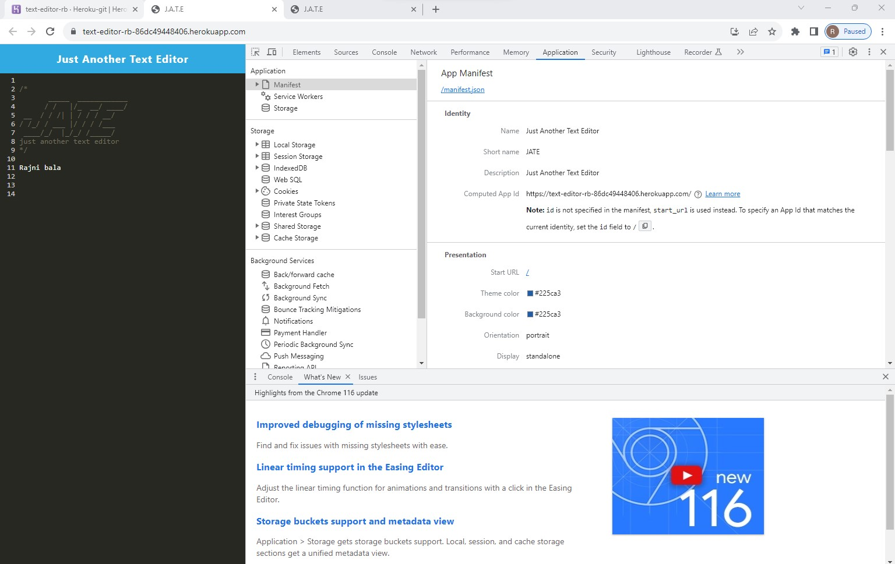
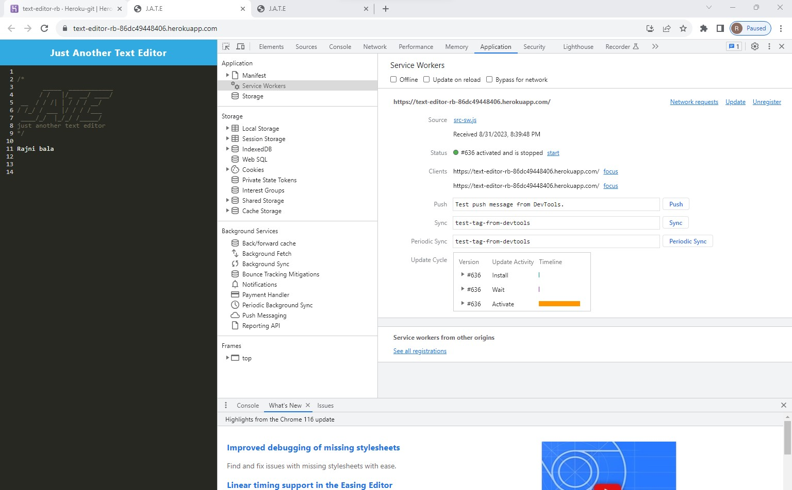
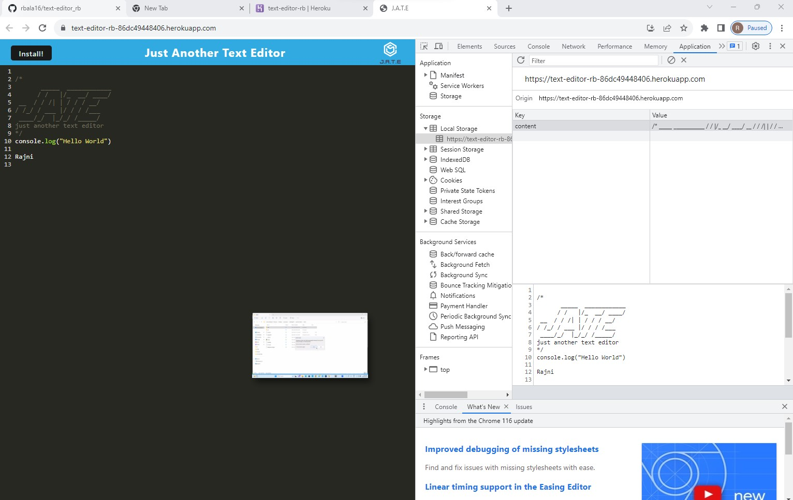
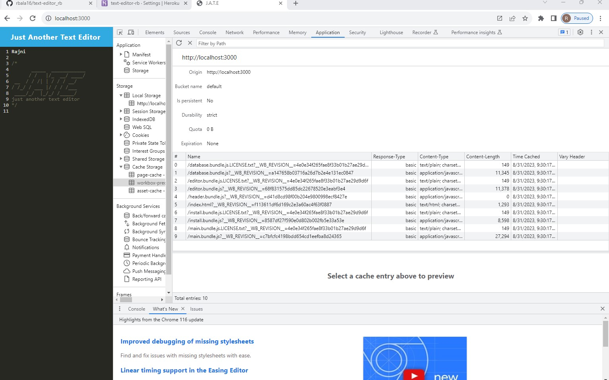

# Progressive Web Applications (PWA): Text Editor

## Description
Build a text editor that runs in the browser. The app will be a single-page application that meets the PWA criteria. Additionally, it will feature a number of data persistence techniques that serve as redundancy in case one of the options is not supported by the browser. The application will also function offline.

## Table of Contents

- [User Story](#user-story)
- [Acceptance Criteria](#acceptance-criteria)
- [License](#license)
- [Installation](#installation)
- [Instructions](#instructions)
- [Contributing](#contributing)
- [Questions](#questions)

## User Story

```md
AS A developer
I WANT to create notes or code snippets with or without an internet connection
SO THAT I can reliably retrieve them for later use
```

## Acceptance Criteria

```md
GIVEN a text editor web application
WHEN I open my application in my editor
THEN I should see a client server folder structure
WHEN I run `npm run start` from the root directory
THEN I find that my application should start up the backend and serve the client
WHEN I run the text editor application from my terminal
THEN I find that my JavaScript files have been bundled using webpack
WHEN I run my webpack plugins
THEN I find that I have a generated HTML file, service worker, and a manifest file
WHEN I use next-gen JavaScript in my application
THEN I find that the text editor still functions in the browser without errors
WHEN I open the text editor
THEN I find that IndexedDB has immediately created a database storage
WHEN I enter content and subsequently click off of the DOM window
THEN I find that the content in the text editor has been saved with IndexedDB
WHEN I reopen the text editor after closing it
THEN I find that the content in the text editor has been retrieved from our IndexedDB
WHEN I click on the Install button
THEN I download my web application as an icon on my desktop
WHEN I load my web application
THEN I should have a registered service worker using workbox
WHEN I register a service worker
THEN I should have my static assets pre cached upon loading along with subsequent pages and static assets
WHEN I deploy to Heroku
THEN I should have proper build scripts for a webpack application
```

## License 
MIT License

## Installation
1. Clone the repository
2. Install the following: 
- npm install

## Instructions
💻   
Run the following command at the terminal:

`npm run start` <br>
- Go to http://localhost:3000/ to view the app on local server<br>

- Go to https://text-editor-rb-86dc49448406.herokuapp.com/ to view the functionality on heroku app

## Contributing
Rajni bala : (https://github.com/rbala16)

## Questions
✉️ Contact me with any questions: [Email:]bala12rajni@gmail.com , [Github](https://github.com/rbala16)<br />

## Mock-Up

The following animation demonstrates the application functionality:


The following image shows the application's `manifest.json` file:



The following image shows the application's registered service worker:



The following image shows the application's IndexedDB storage:



The following image shows the application's coache storage:


<br>

Step by Step Instructions  has been provided in this walkthrough video,view that for more details


## Important Links

You are required to submit the following for review:

* The URL of the deployed application
https://text-editor-rb-86dc49448406.herokuapp.com/

* The URL of the GitHub repository, with a unique name and a README describing the project<br>
https://github.com/rbala16/text-editor_rb

* Walkthrough viedos of functinality of app:<br>
https://drive.google.com/file/d/1K7T2_jlN-jkmgSYkw6YAxdYU_rMEFk6q/view
- - -
© 2023 edX Boot Camps LLC. Confidential and Proprietary. All Rights Reserved.
